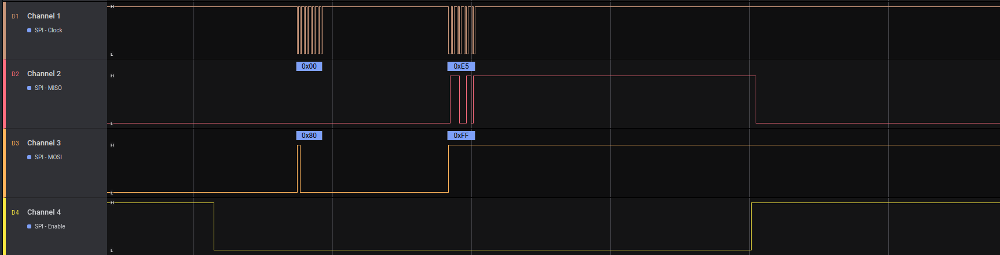
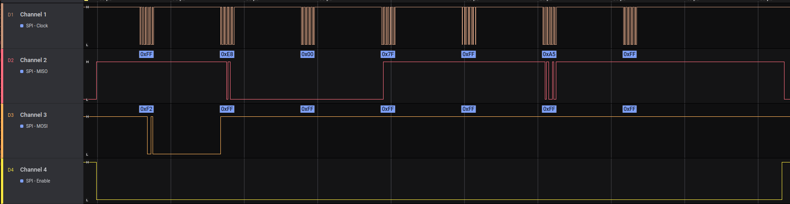

### Description

This project demonstrates a layered embedded architecture for working with an external SPI device 
(ADXL345 accelerometer) using a custom lightweight SDK (uSDK).

The system is built around an event-driven design and asynchronous SPI transactions.

**Architecture**

The project is organized into several layers:

- Application (main.c) – event-driven logic and system state handling

- Board (board.c) – board-specific configuration and component wiring

- Device (adxl345.c) – ADXL345 protocol implementation

- Transport (spi.c) – asynchronous SPI driver with transaction queue

- Platform (stm32f4xx) – MCU-specific register-level implementation

**Execution flow**

- Read ADXL345 DEVID register

- Configure the sensor (POWER_CTL)

- Continuously read acceleration vector (X/Y/Z)

SPI transfers are interrupt-driven, and device callbacks publish events into a global event queue processed by the application.

### Set up

Target: NUCLEO-F411RE
Accelerometer: ADXL345 (SPI/I2C)

### Connection 

**NOTE:** SPI1 example

| Nucleo pin   | GPIO        | ADX345 pin   |
|--------------|-------------|--------------|
| CN10 (11)    | PA5 (sck)   | SCL          |
| CN10 (13)    | PA6 (miso)  | SDO          |
| CN10 (15)    | PA7 (mosi)  | SDA          |
| CN7 (28)     | PA0 (cs)    | CS           |
| GND          | GND         | GND          |
| 3.3V         | 3.3V        | VCC          |

**NOTE:** INT1, INT2 - NC

### Get started

1. Clone

```
git clone git@github.com:GIYura/stm32f4xx-nucleo.git
```

2. Navigate

```
cd examples/accel
```

3. Compile

```
./scripts/build
```

4. Follow prompts to run OCD or Flash the target

**Diagram**

Data flow from hardware interrupt to application logic is organized through callbacks and an event queue.

        SPI Peripheral
              │
              │  SPI IRQ (TXE / RXNE)
              ▼
      +-------------------+
      |   SPI Driver      |
      |    spi.c          |
      |-------------------|
      | SpiIrqHandler()   |
      +-------------------+
              │
              │ Transaction completed
              ▼
      +-------------------+
      | Device Driver     |
      | adxl345.c         |
      |-------------------|
      | onTransactionDone |
      +-------------------+
              │
              │ publish event
              ▼
      +-------------------+
      |   Event Queue     |
      |   event.c         |
      +-------------------+
              │
              │ dequeue event
              ▼
      +-------------------+
      |   Application     |
      |     main.c        |
      |-------------------|
      | state machine     |
      +-------------------+

**SPI transaction**

Adxl read ID

 

Adxl read vector

 

