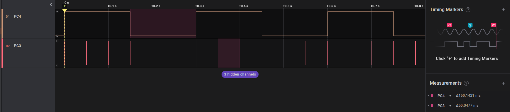

### Description

SW-Timer demo.

Two gpios (PC3, PC4) toggled based on sw-timer. Sw-timer based on RTC (10 ms).
Sw-timer timeout is setup in RTC ticks.

**Example:**
sw-timer timeout 15 means: 15 ticks * 10 ms (RTC period) = 150 ms.

### Structure

- `bsp/config` - contains platform-specific make file
- `bsp/stm32f4xx` - contains board-specific files
- `scripts` - contains bash script to create build
- `src` - applcation code
- `uSDK` - link to shared SDK

### Set up

Target: NUCLEO-F411RE

### Connection 

| Nucleo pin   | GPIO   | Function    |
|--------------|--------|-------------|
| CN7 (37)     | PC3    |             |
| CN10 (34)    | PC4    |             |

