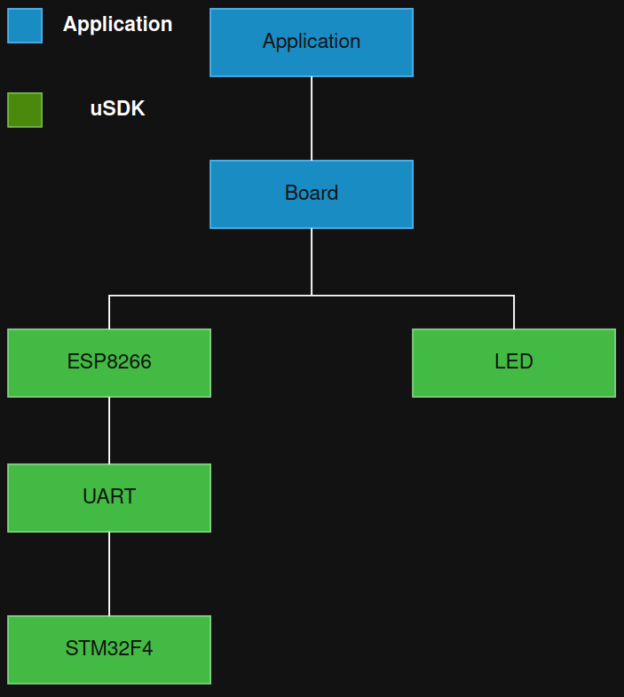

### Description

Demo project to demonstrate control LED over WI-FI.

### Set up

Target: NUCLEO-F411RE
WIFI: ESP8266

### Connection 

**UART_1**

| Nucleo pin   | GPIO        | ESP pin      |
|--------------|-------------|--------------|
| CN10 (33)    | PA10        | tx           |
| CN10 (21)    | PA9         | rx           |
| CN7 (18)     | +5V         | +5V          |
| CN7 (20)     | GND         | GND          |

**UART_2**

**NOTE:** UART_2 (pins PA_2, PA3) are used for VCP.

Pins PD_5, PD_6 are not populated on Nucleo board.

**UART_6**

| Nucleo pin   | GPIO        | ESP pin      |
|--------------|-------------|--------------|
| CN10 (12)    | PA11        | tx           |
| CN10 (14)    | PA12        | rx           |
| CN7 (18)     | +5V         | +5V          |
| CN7 (20)     | GND         | GND          |

**LED**

| Nucleo pin   | GPIO        | LED          |
|--------------|-------------|--------------|
| CN7 (37)     | PC3         | Yellow       |
| CN10 (34)    | PC4         | White        |
| Build-in     | PA5         | Green        |


### Hierarchy

Application -> Board/BSP -> ESP8266 module / LED / SW timer -> HAL -> STM32 platform drivers

### Data flow

- MCU sends AT commands over UART

- ESP creates AP/server

- Client sends LED_ON

- UART ISR receives bytes

- RX timeout via sw-timer

- ESP parser emits response

- Event queue delivers action to application

### Get started

1. Clone

```
git clone git@github.com:GIYura/stm32f4xx-nucleo.git
```

2. Navigate

```
cd examples/wi-fi
```

3. Compile

```
./scripts/build
```

4. Follow prompts to run OCD or Flash the target

### Wifi connection

NOTE: default mode:
- Access point (AP ST-ESP8266)
- password: 1234578
- TCP port: 3333
- Server IP: 192.168.4.1

1. Load firmware to the target

2. Browse wifi network named ST-ESP8266

3. Connnect to ST-ESP8266 network

4. Run

```
ping <server ip-address>
nc -v <server ip-address> <port>
```

5. Run commands

```
LED_ON
LED_OFF
```



